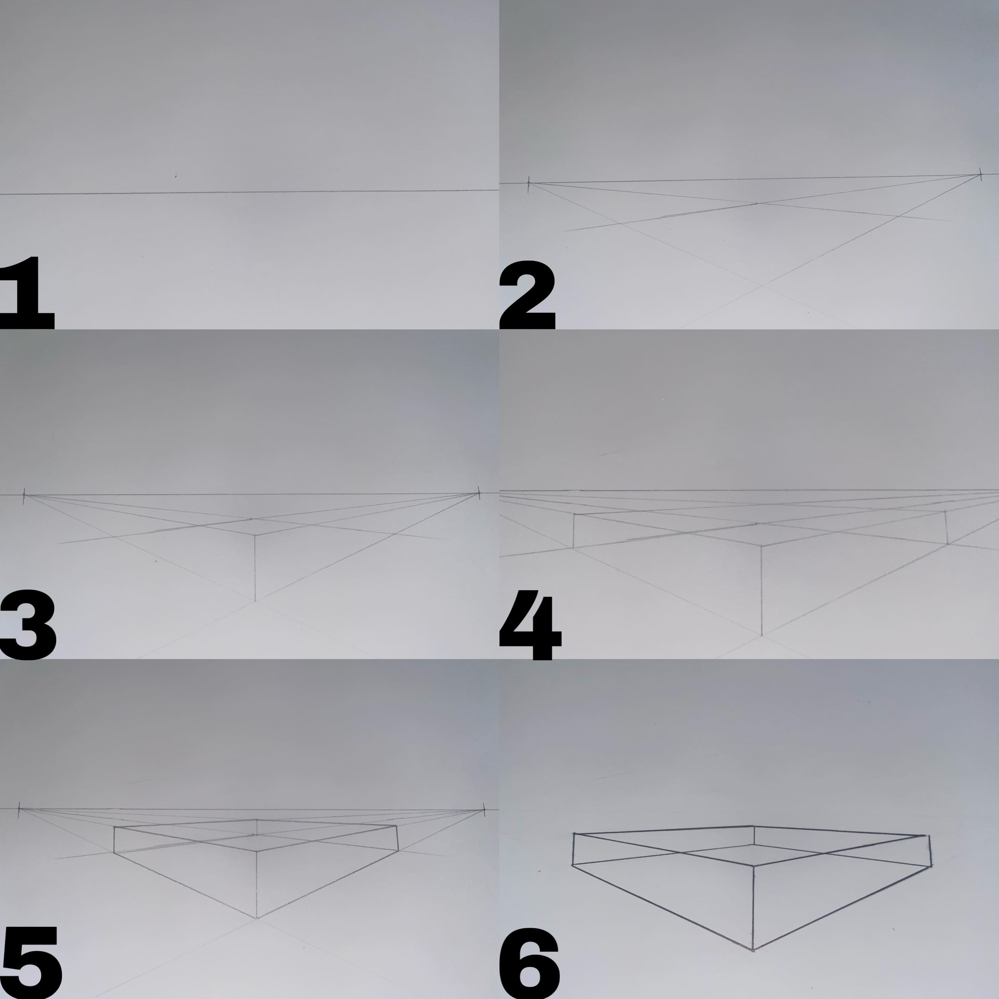

+++
title = "Fluchtpunkt Zeichnung"
date = "2022-05-16"
draft = false
pinned = false
tags = ["Fluchtpunkte", "Perspektive"]
image = "20220516_190400000_ios-6-.jpg"
description = "Anleitung Zwei-Punkt-Perspektive"
+++

Wenn wir ein Haus realistisch zeichnen wollen, können wir dies entweder mit der Ein-Punkt-Perspektive, Zwei-Punkt-Perspektive oder mit der Drei-Punkt-Perspektive machen. Die Zwei-Punkt-Perspektive wird sehr oft benutzt, deshalb zeige ich hier, wie man diese zeichnet. Wir beginnen damit eine Horizontlinie zu zeichnen und auf dieser links und rechts je einen Fluchtpunkt einzuzeichnen. Danach ziehen wir je zwei Fluchtlinien von den Fluchtpunkten aus, welche dann eine Fläche ergeben. An der mittleren Ecke ziehen wir eine senkrechte Linie nach oben und verbinden diese ebenfalls mit den Fluchtpunkten. Jetzt können wir an den übrigen Ecken noch senkrechte Linien zeichnen. Und die übrigen Ecken mit den Fluchtpunkten verbinden. Am Schluss kann man den Quader mit Fineliner nachzeichnen und die übrigen Fluchtlinien ausradieren und hat dann das fertige Ergebnis. Man kann auch eine schwierigere Zeichnung auf diese Weise machen dafür braucht man einfach mehr Fluchtlinien. Zu Beginn kann man bei schwierigeren Zeichnungen auch mit einer Schritt für Schritt Anleitung arbeiten.